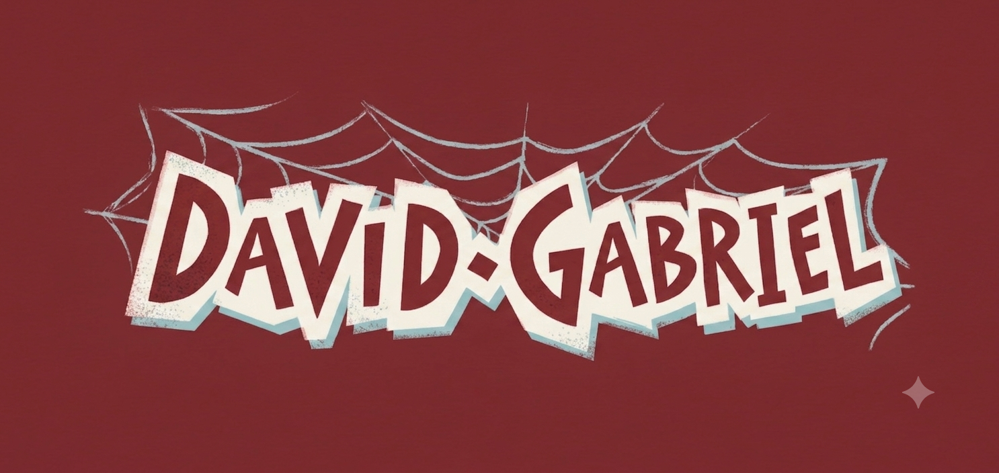
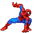
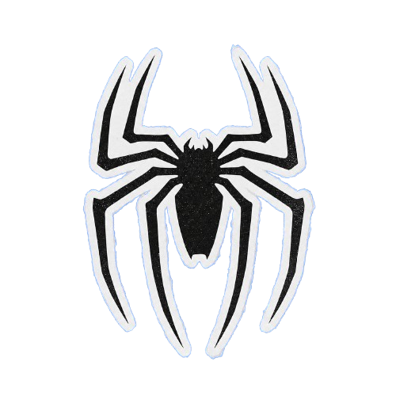
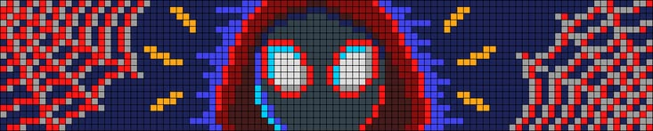
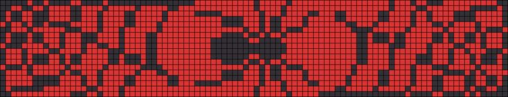
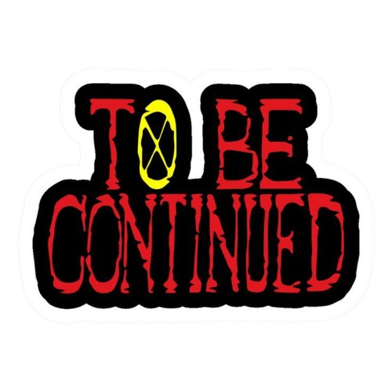

 

 

<table>
<tr>
<td width="180" align="center" valign="top">

### 𝕯𝖆𝖛𝖎𝖉   
𝕲𝖆𝖇𝖗𝖎𝖊𝖑

_Estudando constantemente algo novo_

📍 Brazil | 🇧🇷 PT-BR

📧 santoswx001@gmail.com

🔗 [Portfolio](#)

</td>
<td valign="top">

𝐖𝐡𝐨 𝐀𝐦 𝐈 ?

Sou estudante de **Técnico em Desenvolvimento de Sistemas (TDS)** no SENAI, apaixonado por tecnologia e em constante aprendizado. Tenho me dedicado a construir uma base sólida no desenvolvimento de software, explorando desde o hardware até a web.

Atualmente, trabalho no VS Code e estou explorando o GitHub para versionar e compartilhar meus projetos. No meu repertório atual de estudos, tenho praticado C#, Python, Banco de Dados e a lógica de programação de microcontroladores com Arduino Uno.

Na frente do desenvolvimento web, estou me aprofundando em HTML e CSS. O meu próximo passo já está traçado: assim que dominar essa estrutura, vou mergulhar no JavaScript para criar aplicações cada vez mais dinâmicas e interativas. Seja bem-vindo ao meu perfil!

</td>
</tr>
</table>

𝙵𝚊𝚕𝚎 𝙲𝚘𝚖𝚒𝚐𝚘 𝙰𝚚𝚞𝚒:

 
 
 
 

 

<table>
<tr>
<td width="70%" valign="top">

> ### ⚠️ Caution
>
> O código nunca está finalizado, ele apenas melhora.
> 
>
> O que você vê aqui é construído com prática, curiosidade e persistência.

</td>
<td width="30%" align="center">

</td>
</tr>
</table>

 

 

 

 

<table width="100%">
<tr>
<td width="60%" valign="top" align="center">

</td>
<td width="40%" valign="top">

### 📌 Mᥡ Pr᥆jᥱᥴt᥉

| Projeto | Descrição | Tecnologias | Link |
| :--- | :--- | :--- | :--- |
| **Projeto 1** | Primeiro site construído na aula do SENAI | HTML, CSS | [Acessar](#) |
| **Projeto 2** | Exercícios e algoritmos em C# | C# | [Acessar](#) |

 

 

</td>
</tr>
</table>

 

### 🏆 Ａｃｈｉｅｖｅｍｅｎｔｓ

> 🏁 **Grand Prix SENAI de Inovação**  
> *Certificado de participação no desafio de inovação do SENAI, focado em trabalho em equipe, ideação e resolução de problemas tecnológicos.*
  

